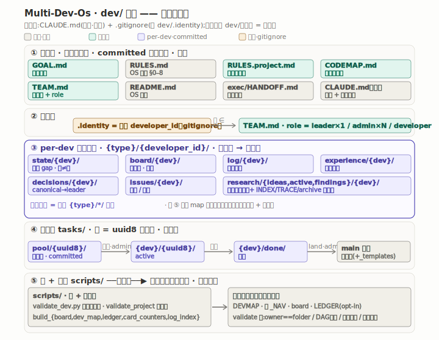
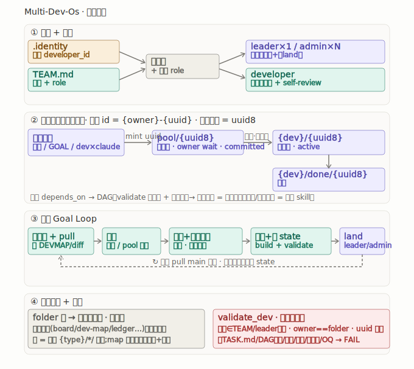

# Multi-Dev-Os

多人同时开发一个项目时用的协作框架,可以直接搬进任何 git 仓库。

几个人一起做一个项目,各自的进度、决策、日志很容易堆在同一批文件上互相覆盖。这里换个做法:每个人只写自己名下的文件夹,需要全局汇总的东西(谁拿了哪些卡、任务依赖关系等)交给脚本从这些文件夹现生成,不手工维护第二份。这样大部分改动不会撞在同一批文件上;剩下少数共享文件,比如花名册、目标、红线,留到合并进 main 时由 leader 收一下。

具体规则见 `dev/README.md`。

---

## 结构和流程





两张图 GitHub 上直接能看。下面用字符画把同样的内容摊开讲。

### 一、完整目录树

```
<project>/
├── CLAUDE.md                       ← 根路由:agent 开局先读它       [框架·勿改]
├── .gitignore                      ← 含 dev/.identity(本机身份不入库)
└── dev/                            ← 团队并发开发 OS（整套）
    │
    ├─❶ 全局单文件（committed · 全队共享一份）
    │   ├── GOAL.md                 终态契约(目标→子系统→工程标准)     [项目填·慢变]
    │   ├── RULES.md                OS 通用铁律 §0–§8                  [框架·勿改]
    │   ├── RULES.project.md        本项目红线/致命错误/性能标准        [项目填]
    │   ├── CODEMAP.md              项目代码结构图(给 agent 导航)      [项目填]
    │   ├── TEAM.md                 花名册:developer_id ↔ role        [项目填]
    │   └── README.md               OS 规约总纲(怎么建)              [框架·勿改]
    │
    ├─❷ 本机身份（不入库 · 每人各异）
    │   └── .identity               = 你的 developer_id(须 ∈ TEAM)   [本地·gitignore]
    │
    ├─❸ per-developer 状态（committed · 各写各文件,基本不冲突）
    │   ├── state/{dev}/state.md          现状 gap(从本地代码来;🟡≠✅)
    │   ├── board/{dev}/board.md          本人活跃卡(生成视图)
    │   ├── log/{dev}/log.md              滚动日志(每 session 一行)
    │   ├── experience/{dev}/...          技术坑经验库
    │   ├── decisions/{dev}/...           决策(canonical 归 leader)
    │   └── issues/{dev}/...              问题/风险登记
    │        ▲ 读任一类要遍历 {type}/*/ 聚合(靠 ❽ 导航 map 定位)
    │
    ├─❹ 任务台 tasks/
    │   ├── pool/{uuid8}/TASK.md          待分配(owner: wait)
    │   ├── {dev}/{uuid8}/TASK.md         已分配给 dev(active)
    │   ├── {dev}/done/{uuid8}/TASK.md    落档
    │   └── _templates/TASK.md            卡模板(YAML frontmatter)    [框架·勿改]
    │
    ├─❺ 研究台 research/（也 per-dev）
    │   ├── ideas/{dev}/  active/{dev}/  findings/{dev}/   灵感→深挖→设计
    │   ├── INDEX.md  TRACE.md            全局聚合视图(溯源)          [项目填]
    │   ├── WORKFLOW.md                   研究调查方法                 [框架·勿改]
    │   └── archive/                      重资料(read-on-demand)
    │
    ├─❻ 执行台 exec/
    │   └── HANDOFF.md                    新 session 入口提示词        [框架·勿改]
    │
    ├─❼ 闸 + 脚本 scripts/（全框架·勿改,除 validate_project）
    │   ├── validate_dev.py               结构+团队+DAG 自检(唯一阻断闸)
    │   ├── validate_project.py           项目锚点/旧路径              [项目填]
    │   ├── build_board.py                生成本人 board
    │   ├── build_dev_map.py              生成 DEVMAP + 各 _NAV
    │   ├── build_ledger.py               全含量任务账本
    │   ├── build_card_counters.py        OQ 计数器派生
    │   ├── build_log_index.py            全员 LOG 统一索引
    │   └── deploy_skills.py              部署 dev/skills 到 Claude 识别目录
    │
    ├─❽ Agent skills/
    │   └── {skill}/SKILL.md              skill 源码(默认部署后进 .claude)
    │
    └─❾ 生成的导航（脚本现生成 · 勿手改 · 只定位）
        ├── DEVMAP.md                     全员→卡(按 developer + area)
        └── {type}/_NAV.md                各 folder 的 developer→文件 索引
```

### 二、身份与角色

```
TEAM.md  developer_id ──▶ role
                          ├── leader     ×1(唯一)  ┐ 可【分配】(pool→{dev})
                          ├── admin      ×N         ┘ + 可【land】(合并进 main)
                          └── developer  ×N           ── 只写 tasks/{自己}/ 名下卡 + self-review

.identity(本机·不入库) = 你是谁;     canonical/全局决策 → 归 leader 的 decisions/{leader}/
```

### 三、任务卡生命周期 + id 体系

```
逻辑 id = {owner}-{uuid}      物理:文件夹名 = uuid 前 8 位 hex(纯,不带前缀)
owner = wait(在 pool) | developer_id     依赖锚 全 32 位 uuid(前缀可变 · uuid 永不变)

  三晋升源                       待分配池            分配(仅 leader/admin)         落档
┌──────────────┐               ┌──────────┐      = 改归属文件夹          ┌───────────────────┐
│ 研究台 findings │─┐            │  tasks/  │   pool/{uuid8}/             │ tasks/{dev}/done/  │
│ GOAL.md gap    │─┼─mint uuid─▶│  pool/   │──────────────────────────▶│  {uuid8}/          │
│ dev×claude 交互 │─┘            │ {uuid8}/ │   →  tasks/{dev}/{uuid8}/   └─────────▲─────────┘
└──────────────┘               └──────────┘      (active · owner:dev)            │ 完成
                                 owner:wait        ────────────────────────────────┘

全部卡的 depends_on 组成有向无环图(DAG),validate 守【无环 + 无悬空】:
        A ──▶ B ──▶ D          连通分量 = 可并行的工作簇
             ╱                  (拆分/分配算法留作后续 skill;DAG 校验已接上)
        C ──╯
        E ──▶ F ──▶ G
```

### 四、为什么并发很少冲突

```
单写者 dev-os:单一 STATE / BOARD / DECISIONS 文件
              └─ 多人并发改同一文件 = git 冲突地狱
        │ 升级
        ▼
团队 dev-os:有主的过程内容全 folder 化  {type}/{developer_id}/...
   ├─ 各 developer 只编自己 folder 的文件         → 不同文件,基本不冲突
   ├─ 全局视图(board/ledger/dev-map/nav/log-index)全脚本从源现生成 → 不留第二份手维护账本,validate 守新鲜度
   ├─ 少数共享单文件(TEAM/GOAL/CODEMAP/RULES.project)仍可能并发改 → leader land 时合并
   └─ 读某类全局信息就遍历 {type}/*/ 聚合;导航 map(DEVMAP/_NAV)定位
        注意:map 只用来定位,实际依据永远是原文 + 对应代码
```

### 五、并发 Goal Loop

```
认身份(.identity / TEAM)
   │  git pull main  +  看 DEVMAP/diff(代码动了→先刷理解,无 commit-hash)
   ▼
取卡 ── developer:自己 tasks/{你}/ 名下 todo(进实现须 review_status=1 且 待拍=0)
       leader/admin:从 tasks/pool/ 分配
   │
   ▼
写实现 + 对抗测试(种已知 bug 门必抓) ──▶ 测试跑绿 · 不破基线
   │
   ▼
落档 tasks/{你}/done/ ─▶ 刷 state/ ─▶ build_board + build_dev_map ─▶ validate_dev
   │
   ▼
land(合并进 main · 仅 leader/admin) ──▶ 他人 pull 同步 ──▶ 各自据新代码刷 state
```

### 六、validate_dev 拦什么

退出码 0 通过、1 失败,可以挂 CI 或 pre-commit。

```
身份   .identity ∈ TEAM · TEAM leader 唯一 · 本机 state+log 在
卡     owner==所在文件夹 · 文件夹名==uuid8 · uuid 唯一不重复 · 缺 TASK.md→FAIL
       非法卡(无 uuid 非 T-xxx)→FAIL · done 卡须 status=done
依赖   无悬空 · DAG 无环
归属   tasks/ 下文件夹须 ∈ {pool, _元目录, TEAM developer_id}(防孤儿)
视图   DEVMAP/_NAV/board 重算比对 = 盘上一致(改卡没跑 build_*→过期 FAIL)
诚实   state ✅ 行须挂可指认证据(防假绿灯) · RULES 不变量检查
OQ     拍板标签只认 [需拍板]/[已决] · 计数器一致 · todo 卡 [必填] 节齐
连带   自动跑 validate_project(项目锚点存在 + 活跃文档无旧路径)
冻结   历史卡保 legacy id(T-xxx)兼容,不重 mint
```

---

## 搬进你自己的项目

### 0. 前提
- 项目已经是 git 仓库,本机装了 Python 3(跑自检脚本要用)。

### 1. 把框架拷进项目
```bash
# clone 本仓库,把 dev/ 和 CLAUDE.md 拷进你的项目根
git clone https://github.com/dreaminate/Multi-Dev-Os.git /tmp/mdos
cp -R /tmp/mdos/dev   <你的项目>/dev
cp    /tmp/mdos/CLAUDE.md  <你的项目>/CLAUDE.md
```
> `dev/` 整套放进项目根,`CLAUDE.md` 也放项目根,agent 一开始先读它。

### 2. 把 .identity 加进项目的 .gitignore
```bash
cd <你的项目>
echo "dev/.identity" >> .gitignore
```
> `dev/.identity` 是每台机器上写自己 id 的文件,不进版本库。本仓库里它是个空占位;填上你的 id 后,在你项目里它被忽略、只留本地。

### 3. 填 5 个项目级文件（模板都在,逐个填）
| 文件 | 填什么 |
|---|---|
| `dev/TEAM.md` | 花名册：你 = `leader`(唯一)；加 `admin`(×N) / `developer` 行 |
| `dev/GOAL.md` | 项目终态契约（§0 目标 + 子系统 + 工程标准） |
| `dev/RULES.project.md` | 本项目红线 / 致命错误即停工 / 性能·数据标准 |
| `dev/CODEMAP.md` | 项目代码结构图（给 agent 导航,不含 dev/） |
| `dev/scripts/validate_project.py` | 填 `PROJECT_ANCHORS`(关键文件) + `STALE_PREFIXES`(旧路径) |

### 4. 建本机身份和状态
```bash
echo "你的-developer-id" > dev/.identity            # 须 ∈ TEAM.md
mkdir -p "dev/state/你的-developer-id" "dev/log/你的-developer-id"
printf '# STATE · 现状 gap\n\n> 现状 vs GOAL,🟡 未验证 ≠ ✅。\n' > "dev/state/你的-developer-id/state.md"
printf '# LOG · 滚动日志\n\n> 每 session 末落一行(做了啥 + 下一步)。\n' > "dev/log/你的-developer-id/log.md"
```

### 5. 自检
```bash
python dev/scripts/validate_dev.py
```
> 没填 `.identity` 时它会报 "`.identity` 为空/缺失",这是正常的初始化提示;把 .identity、state、log 补齐后就转 PASS。

### 6. 部署 Agent skills（按需）
`dev/skills/` 是源码位置;默认只部署到 Claude Code 识别的项目级 `.claude/skills/` 或用户级 `~/.claude/skills/`。搬进项目后运行:

```bash
python dev/scripts/deploy_skills.py
python dev/scripts/deploy_skills.py --write --replace
python dev/scripts/deploy_skills.py --scope user --write --replace
```

### 7. 日常开发
入口提示词是 `dev/exec/HANDOFF.md`,整段复制给新 session。
- 取卡:developer 取自己 `tasks/{你}/` 名下的 todo;leader/admin 从 `tasks/pool/` 分配。
- 干活:写实现,配上对抗测试(种一个已知的 bug,测试得抓住),跑绿、不破基线。
- 收尾:落档到 `tasks/{你}/done/`,刷 `state/{你}/`,跑 `build_board.py`、`build_dev_map.py`、`validate_dev.py`。
- 分配和 land(合并进 main)只有 leader/admin 能做。

---

## 给 Claude 的初始化提示词

把 dev/ 拷进项目后,整段复制给 Claude:

```
把这套团队并发开发 OS 初始化进本项目。按顺序做,哪一步缺信息就停下问我,不要自己编:
1. 先读框架(这几个不要改):dev/README.md、dev/RULES.md、dev/exec/HANDOFF.md。
2. 定团队,写 dev/TEAM.md:问我成员和角色(我是 leader,唯一;另有 admin 若干、developer 若干)。
3. 建本机身份 dev/.identity(一行,我的 developer_id,要在 TEAM 里),并把 dev/.identity 加进项目根的 .gitignore。
4. 填项目契约(逐个问我、再扫代码,照模板填):dev/GOAL.md、dev/RULES.project.md、dev/CODEMAP.md、dev/scripts/validate_project.py。
5. 建我的状态:dev/state/{我的id}/state.md 和 dev/log/{我的id}/log.md。
6. 跑 python dev/scripts/validate_dev.py 自检,绿了就绪。
7. 之后每次开工拿 dev/exec/HANDOFF.md 当入口。

一开始就守住几条:文件夹和文件名严格照框架,不自己造、不改名(validate 会抓);每个文件照它顶部的格式骨架和对应模板填;state/board/log/experience/decisions/issues 和研究台都是按人分的文件夹,读要遍历聚合;DEVMAP 和 _NAV 只用来定位,实际依据看原文和代码;分配、land 只有 leader/admin;声称但没验证的别写成已验证。
```

## 这些文件别在项目里改

它们是框架本身。要改就改这个仓库再同步下去,别在某个项目里单独改、改出分叉。

`dev/RULES.md` · `dev/README.md`(OS 规约) · `dev/exec/HANDOFF.md` · `dev/tasks/_templates/TASK.md` · `dev/research/{WORKFLOW, ideas/README, ideas/_TEMPLATE, active/README, active/_TEMPLATE, findings/_TEMPLATE}.md` · `dev/scripts/{validate_dev, build_board, build_dev_map, build_ledger, build_card_counters, build_log_index}.py` + `scripts/README.md` · 根 `CLAUDE.md`。

## 几个要点

- 身份:`.identity`(本机)加 `TEAM.md`(全员和 role)。分配、land 只有 leader/admin 能做;developer 只写自己名下的卡,自己 review。
- 任务卡:从 `tasks/pool/{uuid8}/`(待分配)分配到 `tasks/{developer_id}/{uuid8}/`(分配就是改它所在的文件夹),做完进 `tasks/{developer_id}/done/`。文件夹名取 uuid 前 8 位,卡里和依赖写全 32 位,依赖一律锚 uuid,前缀可以改、uuid 不变。
- folder 化:state、board、log、experience、decisions、issues、研究台都按 `{type}/{developer_id}/` 分,读某一类就遍历聚合;全局决策归 leader 的文件夹。
- 生成的视图不手写:board、ledger、dev-map、log-index、nav 全是脚本现生成的。
- 自检:`validate_dev.py` 查身份在不在 TEAM、leader 是否唯一、卡的 owner 跟所在文件夹是否一致、文件夹名是否等于 uuid8、依赖是否悬空或成环、state 有没有报假绿灯。
- 代码新鲜度:开工前先 `git pull` main;如果新提交动了你这张卡依赖的代码,先看 diff 和 DEVMAP 再动手。
